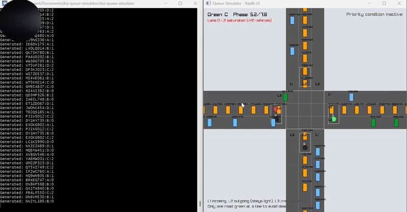

# DSA Queue Simulator

A practical implementation demonstrating the application of Queue data structure to solve real-world traffic management problems.

##  Overview

This project showcases how the Queue data structure (FIFO - First In First Out) can be effectively applied to simulate and manage traffic flow scenarios, such as vehicle queuing at intersections.

## Demo 

  
  

**▶ Click on gif or click the link below to watch full explanation video in youtube**  
https://youtu.be/3pxFtGaizRs    

## Before (Problem) 
* All lanes are treated equally, even if some have huge number of vehicles  
* Priority lane (AL2) is not recognized. 
This causes:  
   * Long waiting times in a particular lane  
   * Unfair vehicle distribution at the junction  
   * Vehicle saturation at busy roads  
   
## After (Solution)  
* AL2 is served immediately when there is more than or equals to ten vehicles.
* Waiting time in AL2 is reduced.
* Al2 is normal if there are less than equals to 5 vehicles.
* System performance improves partially.

## Summary of Work

The given assignment was to implement a queue data structure to solve a real-life traffic management problem.  
The most challenging part of the assignment was implementing the simulation.

After doing some research, I found a popular lightweight C graphics library called **Raylib**. It is open source and was developed by a programmer named *Ray*, mainly for game development. Compared to **SDL2** (which was originally suggested), Raylib proved to be simpler and more effective for this project.

Although the graphical interface is simple, the queue logic is not affected. Vehicles are made to disappear after crossing the intersection to avoid additional GUI complexity.

### Vehicle Serving Logic

Vehicles are served based on the **average number of vehicles waiting** in normal lanes:

|V| = (1 / n) × Σ |Lᵢ|

Where:
- `n` = Total number of lanes (3 → BL2, CL3, DL4)
- `|Lᵢ|` = Number of vehicles waiting in the *i-th* lane
- `|V|` = Number of vehicles served at once

Since it is difficult to count the exact number of vehicles passing through the junction, the system estimates the required green light time using:

Green Light Time = |V| × t

Where:
- `t` = Estimated time required for one vehicle to pass

### Priority Lane Handling

When the number of vehicles in a lane exceeds **10**, the lane is considered saturated.

In this program, **AL2** is defined as the priority lane:

- If vehicles in **AL2 ≥ 10**, it is served immediately
- Once vehicles drop to **≤ 5**, AL2 is treated as a normal lane again

This approach reduces congestion in the priority lane while maintaining fair service for other lanes. 
 
## Table: Data Structures Used

| Data Structure     | Implementation                                                                                 | Purpose                                                                                                        |
| ------------------ | ---------------------------------------------------------------------------------------------- | -------------------------------------------------------------------------------------------------------------- |
| **Array (Static)** | `Vehicle vehicles[MAX_VEH]`    Fixed-size array of 64 vehicle structs                       | Vehicle pool management – stores all active and inactive vehicles in the simulation                            |
| **Explicit Queue** | `LaneQueue laneQueues[4][3]`    4 roads × 3 lanes                                           | Models traffic lanes as FIFO queues: vehicles are enqueued at tail (spawn) and dequeued at head (intersection) |
| **Priority Flag**  | `al2PriorityActive` + threshold logic (`PRIORITY_ON_THRESHOLD`, `PRIORITY_OFF_THRESHOLD`)      | Implements AL2 lane priority – green light forced for AL2 lane when vehicle count ≥ 10                         |
| **Struct**         | `typedef struct { float x, y, vx, vy; int road, lane; bool active; char plate[16]; } Vehicle;` | Encapsulates vehicle state including position, velocity, lane assignment, and plate ID                         |
| **2D Array**       | `float laneSatTimer[4][3]`                                                                     | Tracks saturation alerts for each lane to display warnings when queue length ≥ 10                              |

 

## Functions Using Data Structures

### Queue-Related Functions

#### 1. SpawnVehicle(int road, int lane, const char *plateOpt)
- **Operation:** Enqueue  
- **Purpose:** Adds a vehicle to the tail of the lane queue  
- **Data Structure:** `vehicles[]` array  

#### 2. LaneCount(int road, int lane)
- **Operation:** Queue length query  
- **Purpose:** Counts the number of vehicles in a specific lane  
- **Data Structure:** Iterates through `vehicles[]`  

#### 3. TransitionVehicleThroughIntersection(Vehicle *v)
- **Operation:** Dequeue + Enqueue  
- **Purpose:** Transfers a vehicle from the current lane to the destination lane  
- **Data Structure:** Updates vehicle road and lane fields  

#### 4. calculateAverageVehicles(void)
- **Operation:** Multi-queue aggregation  
- **Purpose:** Computes the average number of vehicles across normal lanes  
- **Formula:**
(AL2 + BL2 + CL2 + DL2) / 4

#### 5. calculateGreenDuration(void)
- **Operation:** Queue-based scheduling  
- **Purpose:** Determines traffic light green duration  
- **Formula:**
duration = avg_vehicles × TIME_PER_VEHICLE (minimum 0.8s)

#### 6. UpdateAl2PriorityState(void)
- **Operation:** Priority threshold check  
- **Purpose:** Enables or disables priority servicing for AL2  

#### 7. LeadGap(const Vehicle *self)
- **Operation:** Queue front detection  
- **Purpose:** Maintains safe spacing between vehicles  

#### 8. ShouldStop(const Vehicle *v)
- **Operation:** Queue discipline enforcement  
- **Purpose:** Enforces traffic rules based on lane type and signal state  

### Supporting Functions

#### 9. PollVehicleFile(void)
- Reads external vehicle data  
- Enqueues vehicles into the simulation  

#### 10. UpdateVehicles(float dt)
- Updates vehicle positions  
- Enforces queue discipline and spacing rules  

#### 11. InitVehicles(void)
- Initializes the vehicle pool  
- Marks all vehicles as inactive  

---

## Main Algorithm (`simulator.c`)

### Initialization
- All vehicles are set to inactive  
- `currentGreen = Road B`  
- `phaseTimer = 0`  
- `greenDuration = 0.8s`  

### Main Loop (60 FPS)

#### STEP 1: Read New Vehicles
- Read up to 16 entries from `vehicles.data`  
- Parse format: `PLATE : ROAD : LANE`  
- Skip incoming-only lanes  
- Enqueue vehicles  
- Detect saturation (queue length ≥ 10)  

#### STEP 2: Priority Condition Check
- If `AL2 ≥ 10` → force green light to Road A  
- If priority active and `AL2 ≤ 5` → disable priority mode  

#### STEP 3: Traffic Light Control
- If priority active → keep Road A green  
- Else:
- Increment phase timer  
- Compute average queue length  
- Update green duration  
- Rotate green light: `A → B → C → D → A`  

#### STEP 4: Vehicle Movement
- L2 lanes obey traffic lights  
- L3 lanes allow free left turns  
- L1 incoming lanes never stop  
- Maintain spacing ≥ 60 px  
- Move vehicles at 80 px/s  
- Transition vehicles through intersection  
- Deactivate vehicles when off-screen  

#### STEP 5: Rendering
- Draw roads  
- Draw traffic lights  
- Draw vehicles  
- Draw alerts and HUD

## Time Complexity of Algorithm

| Function                   | Complexity | Reason                     |
| -------------------------- | ---------- | -------------------------- |
| LaneCount()                | O(n)       | Loops through all 64 vehicles to count matches |
| calculateAverageVehicles() | O(n)       | Calls LaneCount() 4 times: 4×n = O(n)          |
| UpdateAl2PriorityState()   | O(n)       | Calls LaneCount() once          |
| LeadGap()                  | O(n)       | Loops through all 64 vehicles to find leader           |
| SpawnVehicle()             | O(n)       | Searches for first inactive slot (worst case 64 checks)     |
| UpdateVehicles()           | **O(n²)**  | Nested: loops 64 vehicles, each calls LeadGap (64 checks)      |

Why O(n²)?

UpdateVehicles() {
    for (i = 0; i < 64; i++) {
        gap = LeadGap(vehicle[i]);
    }
}

Outer loop → n

Inner loop → n

Total operations → n × n

**Therefore, the dominant time complexity of the algorithm is: O(n²)**
## Traffic Queue Simulator — Installation & Running Guide

### 🐧 Arch Linux — Build & Run

### 1️⃣ Install dependencies
bash  
`sudo pacman -S gcc raylib pkgconf`
### 2️⃣ Compile programs
Traffic generator (console-only)  
`gcc -Wall -O2 traffic_generator.c -o traffic_generator.exe`
   
Simulator (raylib GUI)  
`gcc -Wall -O2 simulator.c -o simulator.exe $(pkg-config --cflags --libs raylib)`

### 3️⃣ Run 
`touch vehicles.data 
./traffic_generator &
./simulator`

### 🪟 Windows — Build & Run (MSYS2 MinGW64)

#### ⚠️ Must be executed inside MSYS2 MinGW64 shell

### 1️⃣ Install MSYS2

`Download from: https://www.msys2.org`  

Open MSYS2 MinGW64 from the Start Menu.

### 2️⃣ Install dependencies

`pacman -S mingw-w64-x86_64-gcc mingw-w64-x86_64-raylib mingw-w64-x86_64-pkg-config`

### 3️⃣ Compile programs
Traffic generator
`gcc traffic_generator.c -o traffic_generator.exe`

Simulator
`gcc -Wall -O2 simulator.c -o simulator.exe $(pkg-config --cflags --libs raylib)`

### 4️⃣ Run
`traffic_generator.exe and
simulator.exe`

## References

### Raylib Documentation

Raylib API Reference: https://www.raylib.com/cheatsheet/cheatsheet.html  
Raylib Examples: https://www.raylib.com/examples.html  
GitHub Repository: https://github.com/raysan5/raylib   

### Tutorials:

Getting Started With Raylib Guide: https://github.com/raysan5/raylib/wiki/Working-on-Windows  
Raylib Beginner Video Series: https://www.youtube.com/playlist?list=PL5gRzHmN4Dg3ubcneVFkHJnLd-Yj_LPWP   
File Handling in C: https://www.youtube.com/watch?v=qg69AXmHhx8  
Similar Traffic Simulation Project: https://www.youtube.com/watch?v=rIrViyBiS7E  

#### Note: The system improves saturation in only a single priority lane in real world scenariors it can be modified to make complex systems to get efficient flow of vehicles.